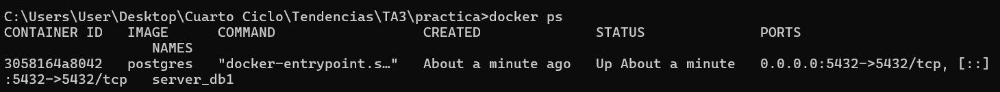
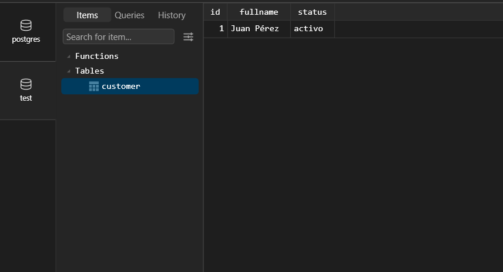
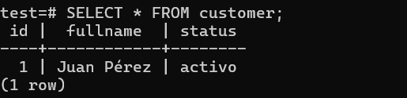
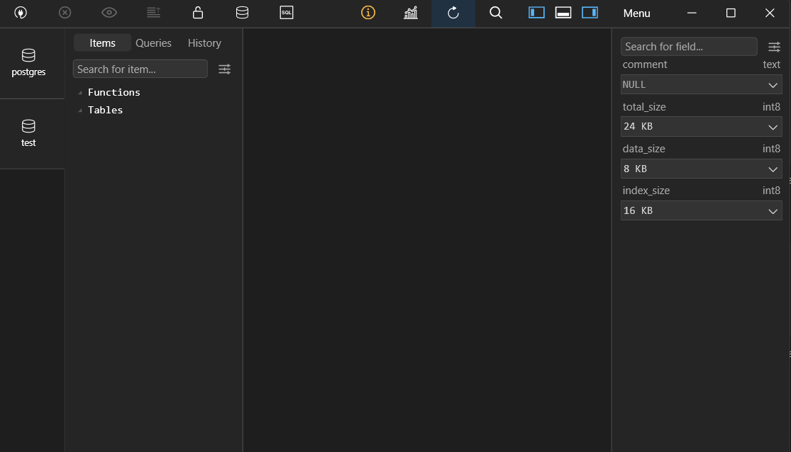
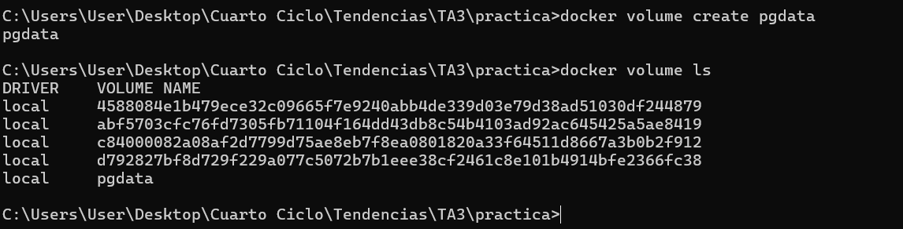
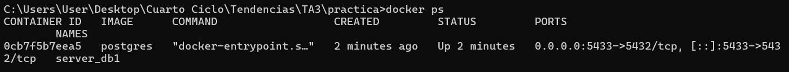
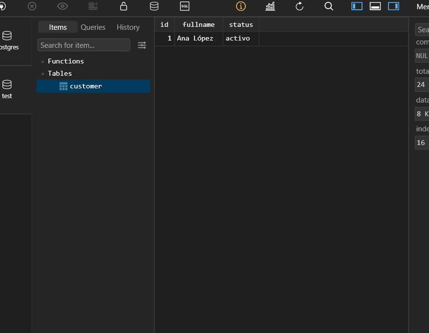
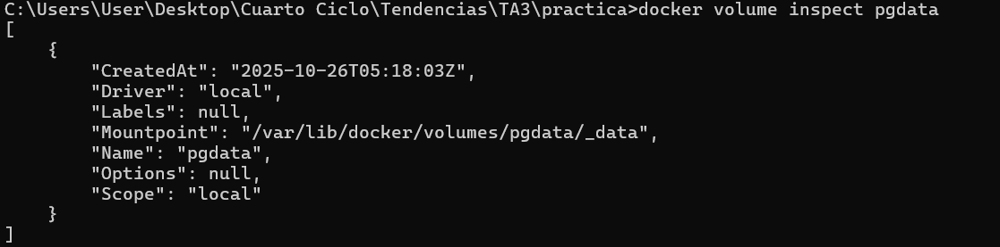

# Práctica No. 3 - Persistencia de datos en contenedores PostgreSQL con Docker

## 1. Título
Persistencia de datos en contenedores PostgreSQL con y sin volúmenes en Docker.

## 2. Tiempo de duración
90 minutos aproximadamente.

## 3. Fundamentos

Docker es una plataforma que permite ejecutar aplicaciones dentro de contenedores ligeros e independientes.  
Cada contenedor tiene su propio sistema de archivos, procesos y red, funcionando de manera aislada del sistema anfitrión. Sin embargo, una de las características más importantes a entender es que **los contenedores son efímeros**, es decir, sus datos se eliminan cuando el contenedor se borra, a menos que se configure un **volumen**.

Un **volumen** en Docker es un mecanismo de almacenamiento persistente que permite conservar los datos incluso si el contenedor se detiene o se elimina. Los volúmenes se guardan fuera del sistema de archivos interno del contenedor, normalmente en `/var/lib/docker/volumes/`.  
Esto es fundamental en bases de datos como PostgreSQL, donde la pérdida de datos puede tener consecuencias críticas.

PostgreSQL es un sistema de gestión de bases de datos relacional (RDBMS) ampliamente utilizado por su robustez, soporte para transacciones ACID y extensibilidad.  
En esta práctica se comparan dos escenarios:
1. Crear una base de datos PostgreSQL **sin volumen**, y verificar que los datos se pierden al eliminar el contenedor.
2. Crear una base de datos PostgreSQL **con volumen**, y comprobar que los datos persisten al volver a crear el contenedor.

Con esto se entiende cómo separar la capa de datos de la capa de ejecución del contenedor, uno de los principios fundamentales de la virtualización moderna.

---

## 4. Conocimientos previos

Para realizar esta práctica el estudiante necesita tener claro los siguientes temas:
- Comandos básicos de Docker (`run`, `stop`, `rm`, `volume create`, `ps`).
- Conocimientos básicos de PostgreSQL y SQL (`CREATE`, `INSERT`, `SELECT`).
- Manejo de un cliente SQL como **TablePlus**, **DBeaver** o **pgAdmin**.
- Comprensión de redes y puertos (localhost, mapeo de puertos).

---

## 5. Objetivos a alcanzar

- Comprobar la pérdida de datos en contenedores sin volúmenes.
- Implementar un contenedor PostgreSQL con persistencia mediante volúmenes.
- Analizar el comportamiento de los datos al eliminar y recrear un contenedor.
- Comprender la función de los volúmenes en la gestión de datos dentro de Docker.

---

## 6. Equipo necesario

- Computador con sistema operativo **Windows 10/11**, **Linux** o **MacOS**.  
- **Docker Desktop** instalado y configurado.  
- Cliente SQL: **TablePlus**.  
- Imagen oficial de PostgreSQL: `postgres:latest`.  
- Conexión a internet para descargar la imagen inicial de Docker.

---

## 7. Material de apoyo

- [Documentación oficial de Docker](https://docs.docker.com)  
- [Documentación de PostgreSQL](https://www.postgresql.org/docs/)  
- Guía rápida de comandos Docker (Cheat Sheet).  

---

## 8. Procedimiento

### 🧩 Parte 1: Base de datos sin volumen

**Paso 1:** Crear el contenedor PostgreSQL  
```bash
docker run -d --name server_db1 -e POSTGRES_PASSWORD=1234 -p 5432:5432 postgres
```

**Figura 1-1.** Contenedor PostgreSQL “server_db1” ejecutándose sin volumen  


---

**Paso 2:** Conectarse desde TablePlus  
- Host: `127.0.0.1`  
- Port: `5432`  
- User: `postgres`  
- Password: `1234`  

**Paso 3:** Crear base de datos y tabla  
```sql
CREATE DATABASE test;
\c test;
CREATE TABLE customer (
  id SERIAL PRIMARY KEY,
  fullname VARCHAR(100),
  status VARCHAR(20)
);
INSERT INTO customer (fullname, status) VALUES ('Juan Pérez', 'activo');
```

**Figura 1-2.** Creación de la base de datos y tabla *customer*  


---

**Paso 4:** Verificar datos  
```sql
SELECT * FROM customer;
```

**Figura 1-3.** Registro insertado en la tabla *customer*  


---

**Paso 5:** Eliminar contenedor y volver a crearlo  
```bash
docker stop server_db1
docker rm server_db1
docker run -d --name server_db1 -e POSTGRES_PASSWORD=1234 -p 5432:5432 postgres
```

**Resultado:**  
La base de datos `test` desaparece al recrear el contenedor.

**Figura 1-4.** Base de datos no persistente al recrear el contenedor sin volumen  


---

### 💾 Parte 2: Base de datos con volumen

**Paso 1:** Crear el volumen  
```bash
docker volume create pgdata
docker volume ls
```

**Figura 1-5.** Volumen Docker “pgdata” creado correctamente  


---

**Paso 2:** Crear contenedor con el volumen  
```bash
docker run -d --name server_db2 -e POSTGRES_PASSWORD=1234 -p 5433:5432 -v pgdata:/var/lib/postgresql/data postgres
```

**Figura 1-6.** Contenedor PostgreSQL “server_db2” ejecutándose con volumen persistente  


---

**Paso 3:** Crear base y tabla nuevamente  
```sql
CREATE DATABASE test;
\c test;
CREATE TABLE customer (
  id SERIAL PRIMARY KEY,
  fullname VARCHAR(100),
  status VARCHAR(20)
);
INSERT INTO customer (fullname, status) VALUES ('María Gómez', 'activo');
```

**Paso 4:** Eliminar y recrear el contenedor manteniendo el volumen  
```bash
docker stop server_db2
docker rm server_db2
docker run -d --name server_db2 -e POSTGRES_PASSWORD=1234 -p 5433:5432 -v pgdata:/var/lib/postgresql/data postgres
```

**Figura 1-7.** Persistencia de datos tras recrear el contenedor con volumen  


---

**Paso 5:** Inspeccionar el volumen  
```bash
docker volume inspect pgdata
```

**Figura 1-8.** Estructura del volumen de datos en Docker  


---

## 9. Resultados esperados

| Prueba     | Volumen | Resultado          |
| ---------- | ------- | ------------------ |
| server_db1 | ❌ No    | Datos eliminados   |
| server_db2 | ✅ Sí    | Datos persistentes |

Los resultados confirman que los datos almacenados en un contenedor **sin volumen** se eliminan al borrarlo, mientras que con un **volumen Docker**, la información persiste incluso tras eliminar y recrear el contenedor.

---

## 10. Bibliografía

- Docker, Inc. (2024). *Docker Documentation*. Recuperado de [https://docs.docker.com](https://docs.docker.com)  
- PostgreSQL Global Development Group. (2024). *PostgreSQL Documentation*. Recuperado de [https://www.postgresql.org/docs/](https://www.postgresql.org/docs/)  
- Pahl, C. (2015). *Containerization and the PaaS Cloud*. IEEE Cloud Computing, 2(3), 24–31.
